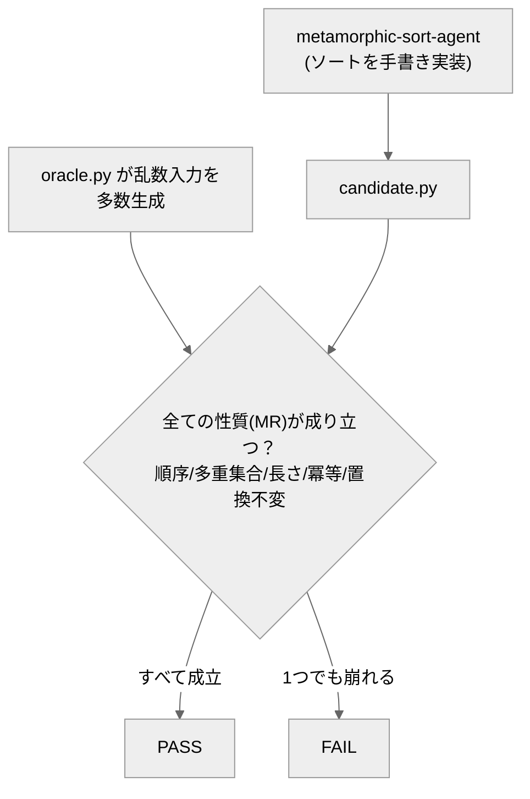

# metamorphic-sort-agent

整数の並べ替え（ソート）を**自分のアルゴリズムで実装する**エージェントと、**正解表を持たずに「性質」で正しさを判定する**オラクル（採点プログラム）。

## 概要

「正しい答え（模範解答）」を用意できない場面でも、ソフトウェアの正しさを確かめたいことがあります。
このリポジトリは、その代表的な手法 **メタモルフィック・テスト** の実例です。

ふつうのテストは「出力＝正解」と突き合わせます。メタモルフィック・テストは正解表を持たず、**「正しい実装なら必ず成り立つ関係（性質）」**を確認します。たとえば並べ替えなら、結果は必ず「小さい順」で「元と同じ顔ぶれ」のはず――これが崩れたら不合格、という考え方です。

## クイックスタート

必要なもの：Python 3 のみ（追加インストール不要）。**コマンドはリポジトリのルートで実行**します。

**(1) 同梱の正しい実装（reference）を採点** — エージェントを動かさなくても確認できます：

```bash
python eval/oracle.py
```

→ 5つの性質がすべて PASS の表が出て、終了コード 0。

**(2) オラクル自身の健全性チェック**（正しい実装は通し、わざと入れた既知バグは弾く、を確認）：

```bash
python eval/oracle.py --selftest
```

→ reference は全性質クリア、3つのバグ実装はそれぞれ性質違反で **FAIL が出るのが正常**。最後に次が出れば成功：

```
## オラクル判定: PASS（バグを捕まえ正例を通す＝信頼できる）
```

## エージェントの動かし方（candidate の作り方）

`agent/metamorphic-sort-agent.md` は **Claude Code 用のエージェント定義（指示書）** です。呼ばれて初めて動きます。

- ソートを実装させるには、この定義を **`.claude/agents/` に置いて呼ぶ**か、定義の指示に従って**任意の LLM に実装させ**、`eval/corpus/candidate.py` に保存します。
- `candidate.py` が無くても、クイックスタート (1) の **reference** で全工程を再現できます。

エージェント出力を採点するとき：

```bash
python eval/oracle.py --candidate candidate
```

## しくみ（どんな性質で判定するか）



`eval/oracle.py` は、**種を固定した乱数入力を多数作り**、次の性質（metamorphic relation）がすべて成り立つかを確認します：

- 順序保存：出力は小さい順（非減少）
- 多重集合保存：出力は入力の並べ替え（要素と個数が同じ）
- 長さ保存：個数が変わらない
- 冪等：もう一度ソートしても同じ
- 置換不変：入力を混ぜても結果は同じ

## ファイル構成

- `agent/metamorphic-sort-agent.md` … エージェントの定義。
- `eval/oracle.py` … 採点プログラム（性質ベースのオラクル。`--selftest` 内蔵）。
- `eval/corpus/reference.py` … 正しい実装の見本（陽性対照）。
- `eval/corpus/broken_*.py` … わざと入れた既知バグ（陰性対照。オラクルがバグを検出できるかの確認用）。
- `eval/corpus/candidate.py` … エージェントが生成する採点対象（`.gitignore` 対象。clone 直後は存在しません）。
- `design/design.md` … 手法の考え方と一般化。

---

自作 AI エージェント集（評価駆動開発の実証）の一つ。手法の背景は [design/design.md](design/design.md) を参照。
